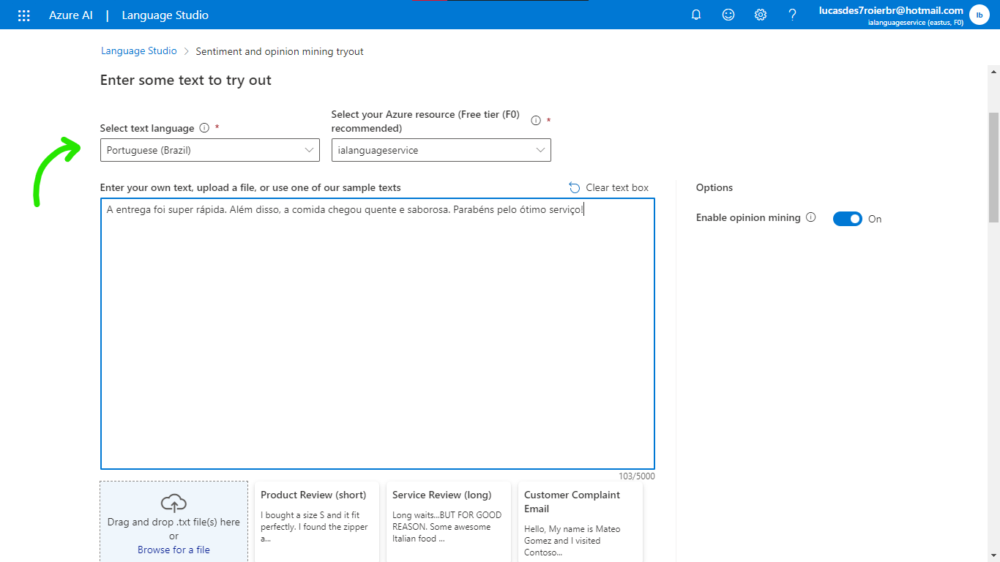

# Crie o recurso

1. Acesse sua conta [**Azure**](https://portal.microsoft.azure.com)
2. Crie um **`novo recurso`**
3. Selecione a opção **`AI + Machine Learning`**
4. Crie o recurso **Análise de texto**

###

###

# Acesse o site do serviço

1. Entre no [**Language Cognitive**](https://language.cognitive.azure.com)

2. Preencha o formulário com os dados da conta conta Microsoft Azure

###

###

# Utilize o serviço

Selecione **`Classify text`** e depois clique no card escrito **`Analyze sentiment and mine opinions`**

###

###

> **Agora que você já está dentro do serviço, selecione o idioma do seu texto e cole-o no campo abaixo como segue o exemplo:**

###

###

> **Role a página para baixo, marque a caixa (checkbox) e receba o seu texto analisado pela IA.**

###

###

# IA trabalhando na prática

###

###

###

# Insights e Possibilidades

### Análise de Sentimento em Mídias Sociais: 

> Monitorar a opinião do público sobre sua marca, produto ou serviço nas mídias sociais. Isso pode ajudar a identificar tendências, perceber feedbacks positivos e negativos e tomar decisões.

### Suporte ao Cliente Inteligente: 

> Poder automatizar respostas a perguntas frequentes, identificar problemas comuns e encaminhar consultas para os departamentos apropriados de forma mais eficiente.

### Resumo de Documentos: 

> Usar a extração de frases chave para criar resumos automáticos de documentos extensos.

#

### **Vale lembrar de que isso é um laboratório de estudos, caso também pretenda realizar esse lab, não se esqueça de excluir TUDO assim que terminar para não ser cobrado posteriormente!!**
